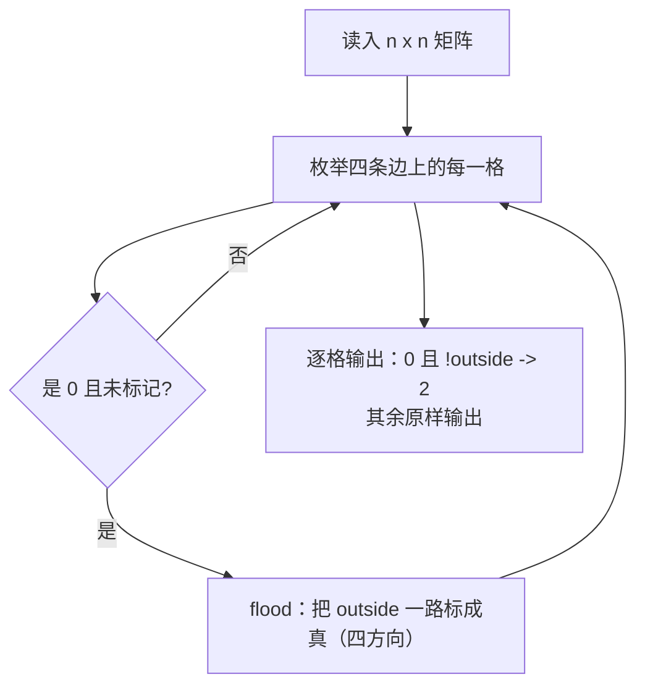

# P1162 填涂颜色

> 原题链接：<https://www.luogu.com.cn/problem/P1162>
> 题面逐字版：[`problem.txt`](problem.txt)
> 本目录导航：[← 题库索引](../../../README.md) ｜ [题目原文](problem.txt) · [讲解代码](solution.cpp) · [分步动画](visualization.html) · [元信息](metadata.yml) · [验算脚本](verify.js)（仅用于验证，非讲解代码）

## 元信息

| 项目 | 内容 |
| --- | --- |
| 难度 | 洛谷难度 2（"反向洪泛"的典型题） |
| 来源 | 洛谷 P1162 |
| 标签 | 搜索、DFS、洪水填充、连通块、四方向、补集转化 |
| 时间复杂度 | $O(4n^2)$，边界反向洪泛一次；实测 $n=30$ 大圈 $5\sim7$ ms |
| 空间复杂度 | $O(n^2)$（`a` + `outside`）+ 递归栈（$n=30$ 圈内最多 $900$ 层，本机正常） |
| 评测状态 | 未本地评测（未在洛谷提交）；本机编译无警告，官方样例逐字正确，与"逐格 BFS 判能否到边界"参照实现随机对拍 200 组 0 不一致（见"验证结论"） |

## 题目大意

> **原文（判定规则，逐字）**："如果从某个 $0$ 出发，只向上下左右 $4$ 个方向移动且仅经过其他 $0$ 的情况下，**无法到达方阵的边界**，就认为这个 $0$ **在闭合圈内**。闭合圈不一定是环形的，可以是任意形状，但保证**闭合圈内**的 $0$ 是连通的（两两之间可以相互到达）。"
>
> 题面另给了一张 $6\times6$ 的涂色前/后对照图（见 `problem.txt`），输入格式："每组测试数据第一行一个整数 $n$（$1\le n\le30$）。接下来 $n$ 行，由 $0$ 和 $1$ 组成的 $n\times n$ 的方阵。方阵内**只有一个闭合圈**，圈内**至少有一个** $0$。"

翻译成人话：$n\times n$ 的 $0/1$ 矩阵里嵌着一个由 $1$ 组成的闭合圈。要求把**圈里面的 $0$** 改成 $2$，圈外的 $0$ 和所有 $1$ 都原样保留，输出整张矩阵。

- 输入：$n$，然后 $n$ 行、每行 $n$ 个用空格隔开的 $0/1$
- 输出：$n$ 行、每行 $n$ 个数字，**空格分隔**（本机的写法是数字间一个空格、行末不留空格）
- 数据范围：$1\le n\le 30$

**题面给的判定规则是一个"可达性定义"**：$0$ 在圈内 $\iff$ 从它出发、只走 $0$、只走上下左右，**到不了边界**。把这句话想清楚，做法就有了（见观察 1）。

## 思路推导

### 1. 直觉做法（照抄定义）：对每个 $0$ 单独试一次

规则怎么写代码就怎么写：

```cpp
for 每个格子 (i,j):
    if (a[i][j] == 0) {
        做一次 BFS/DFS，问"从 (i,j) 只经过 0 能不能碰到边界"
        碰不到 -> a[i][j] = 2
    }
```

逻辑上完全正确（`verify.js` 里的参照实现就是它）。**代价**：每个 $0$ 都要重新一张 `seen` 表、重新走一遍它所在的整块。最坏 $n^2$ 个 $0$、每次 BFS $O(n^2)$ ⇒ $O(n^4)$。本机实测这条曲线（JS 版参照，$0/1$ 随机图，每次数据不同、耗时有浮动）：

| $n$ | 朴素参照耗时（本机实测，每次随机图不同） |
| --- | --- |
| $30$ | $5\sim7$ ms |
| $60$ | $57\sim69$ ms |
| $120$ | $0.77\sim0.90$ s |
| $240$ | $12.3\sim13.4$ s |

边长翻倍、时间约乘 $16$，正是 $O(n^4)$ 的样子。$n\le30$ 时它侥幸能过，但**同一块 0 区域被反复重走**这件事完全没必要 —— 这就是本题要教的东西。

### 2. 关键观察

#### 观察 1：把定义逆过来用 —— "能到边界的 0 全是圈外"，从边界反向洪泛一次

题面判据是"到不了边界 ⇒ 圈内"。它的**逆否命题**同样成立：

$$\text{能到边界} \iff \text{在圈外}$$

"能到边界的 0" 恰好就是**所有与边界相连的 $0$ 连通块**。于是从四条边上的所有 $0$ 出发做一次洪泛，整片"圈外"就全被标记了；剩下的没被标记的 $0$ 就是圈内，涂 $2$。

- 朴素做法：**每个 $0$ 问一次** ⇒ $O(n^4)$；
- 反向洪泛：**只问一次**（起点换成"整条边界"）⇒ $O(n^2)$。

两者判据一字不差，只是"谁来问"变了。这是搜索题里非常通用的一招：**当你要对很多个点问同一个可达性问题时，把源点和目标点对调，做一次多源洪泛。**

#### 观察 2：起点必须是**四条边的每一格**，不是某个角

最容易写错的地方。圈可以贴边、可以把某个角堵成 $1$，此时从 $(1,1)$ 单点出发什么都淹不到，于是**所有** $0$ 都被误判成圈内。本机实测（$4\times4$ 数据 `1 1 1 1 / 1 0 0 1 / 0 0 0 1 / 1 1 1 1`，圈贴住上边、左上角是 $1$）：

| 写法 | 输出 |
| --- | --- |
| 只从 $(0,0)$ 一个角出发 | `1 1 1 1 / 1 **2** **2** 1 / **2** **2** **2** 1 / 1 1 1 1`（整片被涂错） |
| 从四条边出发（正确） | `1 1 1 1 / 1 0 0 1 / 0 0 0 1 / 1 1 1 1` |

**阴险之处**：官方样例 $6\times6$ 上，"只从 $(1,1)$ 出发"的写法输出**完全正确**（本机实测），也就是说这个 bug 靠样例抓不出来，只能靠想清楚"我要标记的是不是全体圈外格"。

#### 观察 3：这是"标记补集"的通用心法，和 P1596/P1451 同族

P1596/P1451 数"有几块"，本题标"哪些格在圈内"。共同点：

- 都用 `vis`/`outside` 这种**永不撤销**的全局标记（洪泛的目的就是划掉已处理的格子）；
- 与 P1605（数路径、回溯必撤销）形成对照 —— 本批四题的核心分界线。

不同点只在**起点集合**：数块时起点是"扫描到的第一个未标记格"，本题起点是"整条边界上的所有 $0$"。

#### 观察 4：圈的"闭合"是按四方向算的，斜角挡不住洪泛（题面规则的反向理解）

题面说圈"可以是任意形状"，同时判定只允许"上下左右"移动。于是**由 $1$ 组成的圈只要有一处两格只共顶点（斜角相接），四方向就读作它是断的**……但这道题的洪泛也在 $0$ 上做四方向移动，所以正确性只依赖题面定义，不受影响。真正会出事的是**把 `outside` 的洪泛误写成八方向**：

本机实测（$5\times5$，墙是四棱形 `0 0 1 0 0 / 0 1 0 1 0 / 0 0 1 0 0`，中心 $(2,2)$ 的四邻全是墙）：

| 洪泛方向 | 中心格输出 |
| --- | --- |
| 四方向（正确） | `2`（到不了边界 ⇒ 圈内） |
| 八方向（错误） | `0`（从 $(1,1)$ 斜插进来被判成"能到边界" ⇒ 漏涂） |

**注意**：这个错误在官方样例上**也看不出来**（本机实测八方向版对样例输出与正解逐字相同），因为样例的圈没有"斜角相接"的窄颈。

#### 观察 5：输出格式是"空格分隔"，且要输出**整张**矩阵

$n$ 行、每行 $n$ 个数字，原来就是 $1$ 的格子和圈外的 $0$ 都要照抄，只有圈内的 $0$ 变 $2$。

### 3. 算法设计

**数据结构**：`a[n][n]` 原图（$0$ 空、$1$ 墙）、`outside[n][n]`（该 $0$ 格是否能到边界）。

**过程**：
1. 读入；
2. 枚举四条边的每一格，是 $0$ 且未标记则 `flood`；`flood(x,y)`：`outside[x][y]=true`，向四个方向推广（界内 / 是 $0$ / 未标记）；
3. 输出：`a[i][j]==0 && !outside[i][j]` ⇒ 打印 `2`；否则打印 `a[i][j]`；数字间一个空格。



### 4. 正确性说明

设图 $G$ 的顶点是 $a[i][j]=0$ 的格子，边是四方向相邻。记 $B=\{\text{位于方阵边界上的 } 0 \text{ 格}\}$。

- **引理 A**：洪泛结束后 `outside[i][j] = true` $\iff$ 在 $G$ 中 $(i,j)$ 与 $B$ 中某个格子连通。
  （$\Leftarrow$）主循环对 $B$ 中每个未标记格子都调用了 `flood`，`flood` 沿 $G$ 的边闭包展开，故该连通块全体被标记（同 P1596 引理 A 的论证）。
  （$\Rightarrow$）`outside` 只可能由 `flood` 置位，而每次 `flood` 调用链的起点属于 $B$、每一步沿 $G$ 的边走，故被置位的格子必与某个 $B$ 中点连通。
- **引理 B**：`outside[i][j]=true` $\iff$ 题面意义上的"从 $(i,j)$ 出发只走 $0$、只走上下左右**可以**到达边界"。
  按题面，"到达边界"就是走到某个边界格，而路径上的点全是 $0$ ⇒ 这正是 $G$ 中与 $B$ 连通，由引理 A 与 `outside` 等价。
- **结论**：程序把 $a[i][j]=0$ 且 `!outside[i][j]` 的格子涂 $2$，由引理 B 恰是题面定义的"在闭合圈内"的 $0$；$1$ 与圈外 $0$ 原样输出。故输出与题目要求逐格一致。$\blacksquare$

（题面保证"只有一个闭合圈、圈内至少一个 $0$"，但上面的论证**不依赖**这个保证 —— 有多个圈、圈不闭合、甚至没有圈时，程序仍然忠实执行"到不了边界的 $0$ 涂 $2$"这条规则。这一点在"常见变式"里会用到。）

### 5. 复杂度分析

- **时间**：边界洪泛每格至多进一次 ⇒ $O(4n^2)$；输出 $O(n^2)$。$n\le30$ 时 $4n^2=3600$，本机实测 $n=30$ 大圈数据 **$5\sim7$ ms**（含进程启动）。对比第 1 节朴素的 $O(n^4)$（$n=30$ 时 $8.1\times10^5$）。
- **空间**：$O(n^2)$；递归深度最坏 $=$ 圈外（或圈内）$0$ 的连通块大小，$n=30$ 时 $\le 900$ 层，本机正常。
- **数组上限**：`MAXN = 35` 是按题面 $n\le30$ 开的。**不要拿它去跑 $n>30$**：本机把 $n=36$ 的数据喂进去，程序没有崩溃但输出 **$0$ 个 $2$**（应为 $1024$ 个），是越界写内存导致的静默错误 —— 比崩溃更危险。

## 板书演示

官方样例 $n=6$，输入矩阵：

```
0 0 0 0 0 0
0 0 1 1 1 1
0 1 1 0 0 1
1 1 0 0 0 1
1 0 0 0 0 1
1 1 1 1 1 1
```

**第一步：从四条边洪泛，把"圈外"标出来。** 讲解代码 [`solution.cpp`](solution.cpp) 用的是独立的 `bool outside[35][35]`，它的 stdout **只有最终那 $n$ 行**；下面这张中间矩阵来自本机**同一份算法的插桩版**（只多打日志，逻辑一字不改），它把 `outside == true` 的格子显示成 `3`：

```
3 3 3 3 3 3
3 3 1 1 1 1
3 1 1 0 0 1
1 1 0 0 0 1
1 0 0 0 0 1
1 1 1 1 1 1
```

数一下这张中间图：$0$ 一共 $18$ 个，其中标成 `3`（= `outside == true`）的 $9$ 个，仍是 `0` 的 $9$ 个 —— 后面表格里逐格核对的就是这两个 $9$。插桩版随后打印的统计原文是 `统计：0 格共 18 个，其中圈外（标 3）9 个、圈内（将涂 2）9 个`，与手工核对一致。

**为什么第 4、5 行里那些 $0$ 没被标成 `3`？** 逐格看（行列都从 $1$ 起；注意原图第 $5$ 行是 `1 0 0 0 0 1`，$(5,1)$ 本身就是墙，不在边界"可走"之列）：

| 区域 | 格子 | 为什么 |
| --- | --- | --- |
| 圈外 $9$ 格 → 标 `3` | 整条上边 $(1,1)\sim(1,6)$；$(2,1),(2,2)$；$(3,1)$ | 上边 $6$ 格**本身就在边界上**，是洪泛的起点；$(2,1),(2,2)$ 与上边相邻被扩下来，$(3,1)$ 又与 $(2,1)$ 相邻 |
| 圈内 $9$ 格 → 保持 `0` | $(3,4),(3,5)$；$(4,3),(4,4),(4,5)$；$(5,2),(5,3),(5,4),(5,5)$ | 四方向被墙封死：上方 $(2,4),(2,5)$ 是 $1$；右方 $(3,6),(4,6),(5,6)$ 是 $1$；下方第 $6$ 行整排是 $1$；左方 $(4,1),(4,2),(5,1)$ 是 $1$。洪泛进不来，等价于这 $9$ 格走不到边界 |
| 墙 $18$ 格 | 全部 $1$ | 洪泛要求 `a[nx][ny] == 0`，墙根本不进递归 |

三类数量正好对上插桩版打印的那行统计：$9+9=18$ 个 $0$，$36-18=18$ 个 $1$。

**第二步：剩下"是 $0$ 且 `outside == false`"的格子打印成 `2`**（板书的 `3` 只是个记号，输出时那一格仍是 $0$）。程序真实打印的最终输出：

```
0 0 0 0 0 0
0 0 1 1 1 1
0 1 1 2 2 1
1 1 2 2 2 1
1 2 2 2 2 1
1 1 1 1 1 1
```

与题面要求逐字一致 ✅。**注意它和题面开头那张 $6\times6$ 的"涂色前/后"示意矩阵不是同一张图**（示意圈的形状不同），板书时别混用。

## 可视化讲解

交互动画见同目录 [`visualization.html`](visualization.html)。本页与 [`solution.cpp`](solution.cpp) **同一套结构**（0-based、递归 `flood()`、独立的 `outside[][]` 标记），代码面板逐帧高亮对应行；左侧棋盘格子里显示的是**这一帧打印出来的值**，底色显示 `outside` 状态，右侧另有**递归栈**面板（最上面就是当前正在执行的那次 `flood`）和变量表，右下角的最终输出**播到最后一帧才揭晓**，避免剧透。

四个必看帧：

1. **进入 `flood(x, y)` 的那一帧** —— 面板写明"函数第一行就是 `outside[x][y] = true`"，即**进门先标记**。递归栈里此时多了一层，栈深度实时可见。
2. **撞到已经标过 `outside` 的邻居** —— 面板说明 `outside` 本身就是 `vis`：不判它，两个相邻空格会互相递归个没完，直接爆栈。
3. **从 `flood(x, y)` 返回的那一帧** —— 面板特意写明"**这里没有撤销 `outside`**"。这一帧是本套动画的教学主线：它和 [`P1219 八皇后`](../p1219-eight-queens/visualization.html) 里的 `col[j] = d1[a] = d2[b] = false;` **正好相反** —— 那道题要枚举所有摆法，撤销是在为兄弟分支恢复世界；本题只问"这块属不属于圈外"，标过就该一直留着。
4. **末帧** —— 输出矩阵逐格揭晓，"还是 $0$ 且 `outside == false`"的格子打印 $2$，圈外的 $0$ 与墙 $1$ 原样输出。

默认载入官方样例 $6\times6$，共 **90 帧**，逐帧走完得到的输出与题面样例**逐字一致**（本机 headless 校验：`0 0 0 0 0 0 / 0 0 1 1 1 1 / 0 1 1 2 2 1 / 1 1 2 2 2 1 / 1 2 2 2 2 1 / 1 1 1 1 1 1`）；另两个预设是题面那张 $6\times6$ 示意图（95 帧）和"一圈套一格"的 $5\times5$（120 帧）。输入框可粘自定义方阵，动画页把规模限制在 $n\le 10$（题面 $n$ 可到 $30$，那规模的解请交给 `solution.cpp` 跑）。

## 讲解代码

完整逐段注释版见 [`solution.cpp`](solution.cpp)。核心：

```cpp
// ① 反向洪泛：从"整条边界"出发，把所有能走到边界的 0 标成圈外
for (int i = 0; i < n; i++) {
    if (a[0][i] == 0 && !outside[0][i])         flood(0, i);       // 上边
    if (a[n-1][i] == 0 && !outside[n-1][i])     flood(n-1, i);     // 下边
    if (a[i][0] == 0 && !outside[i][0])         flood(i, 0);       // 左边
    if (a[i][n-1] == 0 && !outside[i][n-1])     flood(i, n-1);     // 右边
}
// ② 剩下的 0 到不了边界 => 圈内 => 涂 2
for (int i = 0; i < n; i++)
    for (int j = 0; j < n; j++) {
        int v = a[i][j];
        if (v == 0 && !outside[i][j]) v = 2;
        if (j) cout << ' ';
        cout << v;
    }
```

**为什么不直接在 `a` 里改（把圈外的 $0$ 原地写成 `3`）？** 那样做也正确，但输出时要记得把 `3` 再打印回 $0$ —— 忘一次就 WA，而且"哪些格本来是空格"这个信息被覆盖了。用独立的 `outside` 数组把**状态**和**输出值**分开（板书里才把 `outside == true` 简写成一个 `3`），这类题不容易绕晕。

**为什么四个 `if` 里的 `!outside[...]` 不能省？** 省了不会错，但会重复展开同一片区域（角上的格子会被上游洪泛两次判定）。写上它，"每格至多进洪泛一次"在代码上就是显然的，复杂度论证才站得住。

## 验证结论

本机 `g++ -static -O2 -std=c++14 -Wall` 编译，**无任何警告输出**。以下为 `node verify.js` 的真实输出（编译产物在 `E:/ai/suanfa_study/_work/search-b/`）：

| 检验项 | 实测结果 |
| --- | --- |
| 官方样例（$n=6$，$6\times6$ 输出含空格分隔） | **逐字一致** ✅（朴素参照也给出同一张图） |
| 随机对拍 | $200$ 组（$n=4\sim9$：随机矩形闭合圈 $75\%$ + 纯随机 $0/1$ 图 $25\%$ 混测）vs **"对每个 $0$ 单独 BFS 问能否到边界"**参照实现，**不一致 $0$ 组** |
| 定向边界 | 圈贴满四边（圈外无 $0$）→ 中心涂 `2`；圈贴上边、左上角是 $1$ → 圈外保持 `0`；全 $0$ 图 → 全 `0`；$3\times3$ 单格墙 → 无改动（四项均与参照一致） |
| 极限规模 $n=30$ 大圈（圈占第 $1/28$ 行列，圈内 $26\times26$） | 涂了 **676** 个 `2`，耗时 **5~7 ms** |
| 极限规模 $n=30$ 随机 $0/1$ 图（同一份图喂给两种写法） | 正解与参照涂的 $2$ **个数相同**（本机两轮分别 $55$、$48$ 个，图是随机的），正解 $5$ ms / 参照 $6$ ms |
| 朴素参照的增长曲线（`1` 占比 $0.4$ 的随机图，每次数据不同、耗时浮动） | $n=30$：$5\sim7$ ms；$n=60$：$57\sim69$ ms；$n=120$：$0.77\sim0.90$ s；$n=240$：$12.3\sim13.4$ s（两轮独立实测合并；边长翻倍时间约 $\times16$，印证 $O(n^4)$） |
| 反例对照 1：只从 $(1,1)$ 一个角出发 | 官方样例**碰巧输出正确**；$4\times4$ 贴边圈数据把整片圈外错涂成 `2` |
| 反例对照 2：洪泛误用八方向 | 官方样例**碰巧输出正确**；四棱形窄颈数据里中心格漏涂（应 `2` 实 `0`） |

> `verify.js` **只是验证工具，不是讲解代码**（讲解代码一律 C++，见 AGENTS.md §3）。参照实现刻意不用"反向洪泛"：它把题面那句"无法到达方阵的边界"**逐字翻译成对每个 $0$ 单独 BFS**，机制与正解完全不同。

**洛谷提交结果未获取，因此不下 AC 结论。**

## 易错点与坑

1. **只从 $(1,1)$（或某一个角）出发洪泛**。正确做法是**遍历四条边的每一格**。实测官方样例上这个 bug **输出照样正确**，而 $4\times4$ 的"圈贴上边、左上是 $1$"数据会把 `1 1 1 1 / 1 0 0 1 / 0 0 0 1 / 1 1 1 1` 整个错涂成 `2`。**样例抓不出来，必须靠推理。**
2. **洪泛方向写成八个**。实测官方样例**同样碰巧正确**；但在"墙只用斜角相接"的窄颈图上，圈外的 $0$ 会从斜缝里被误判为可达，导致圈内**漏涂**（本机 $5\times5$ 四棱形数据：四方向中心 `2`，八方向中心 `0`）。题面写得很清楚"只向上下左右 4 个方向移动"。
3. **忘了把"边界"理解成方阵的四条边**。题面的"边界"是矩阵外沿那一圈格子，不是"圈的边界"。判据写成"到不了 $(1,1)$"是另一种常见误解 —— 到得了别处边界格也算圈外。
4. **涂色时把 $1$ 也涂掉**。输出条件必须是 `a[i][j] == 0 && !outside[i][j]`。漏掉 `a[i][j]==0` 就直接改 `a` 或写成 `if (!outside) v = 2;`，实测样例输出变成 `0 0 0 0 0 0 / 0 0 2 2 2 2 / 0 2 2 2 2 2 / 2 2 2 2 2 2 / ...`（整面墙被推平）。
5. **越界判断写在数组访问之后**。`if (a[nx][ny] == 0 && nx >= 0 ...)` 先访问了 `a[-1]`。先判范围是铁律。
6. **数组按下标越界写**。`MAXN` 按题面 $n\le30$ 开成 $35$；本机把 $n=36$ 的数据喂进 `solution.cpp`，程序**没有崩溃**，输出 `0` 个 `2`（该数据应有 $1024$ 个）—— 越界写内存的静默错误形态。**这不是"我的代码能跑 $n=36$"，恰恰相反。**
7. **输出格式**：要输出**整张**矩阵、$n$ 行、数字之间空格分隔；行末多一个空格在洛谷通常被容忍，但**少一行、少一列**必 WA。另外别忘了圈外的 $0$ 仍然是 $0$，不是空着不输出。
8. **在原地改 `a` 而不留 `outside` 数组**。把圈外先涂成别的数（比如 $2$）再"找剩下的 $0$"，方向就反了 —— 要涂的正是**没被洪泛到的**那批。用独立标记数组最不容易绕晕。
9. **递归栈**：$n=30$、单块 $900$ 格时递归深度可到 $900$ 左右，本机正常；但这道题本质是"洪泛"，写成 BFS（队列）同样 $O(n^2)$，遇到"题面 $n$ 更大"时应优先换 BFS。

## 常见变式

| 变式 | 差异 | 应对 |
| --- | --- | --- |
| 圈内圈外都要输出不同数字（如圈外填 3） | 只是输出分支多一条 | `outside` 数组直接给了答案，改 $1$ 行 |
| 矩阵里可以有**多个**闭合圈 | 本题保证"只有一个圈"，但反向洪泛**天然支持多个圈** | 代码一字不改（见正确性说明：论证不依赖"只有一个圈"） |
| 圈不闭合（有缺口） | 缺口处圈内与圈外连通 ⇒ 该"圈"内一格都不涂 | 同上，代码不改；这是检验"是否真懂逆否命题"的最好课堂提问 |
| 问"圈内有多少格" | 计数而非涂色 | 输出前统计 `a==0 && !outside` 的个数 |
| 问"最大的圈面积" | 需要对每个"到不了边界"的连通块求大小 | 对剩余 $0$ 再做一次洪泛计数（仍是 $O(n^2)$） |
| $n$ 放大到 $10^3$ | 朴素 $O(n^4)$ 彻底不可行；反向洪泛 $O(n^2)=10^6$ 仍可行 | 必须用观察 1 的转化，并且把递归改 BFS |
| 三维立方体（$n\times n\times n$，从六个面反向洪泛） | 方向变 $6$ 个，起点变"六个面" | 框架不变，是本题最自然的课后作业 |

## 小结

> **"到不了边界"这种判据一律反过来做：从边界出发洪泛一次标出所有"到得了边界"的格子，剩下没被标记的就是答案 —— 一个 $O(n^4)$ 的问题当场变成 $O(n^2)$；而"从整条边界出发"和"只用四方向"这两件事，在官方样例上出错都是碰巧看不出来的。**
