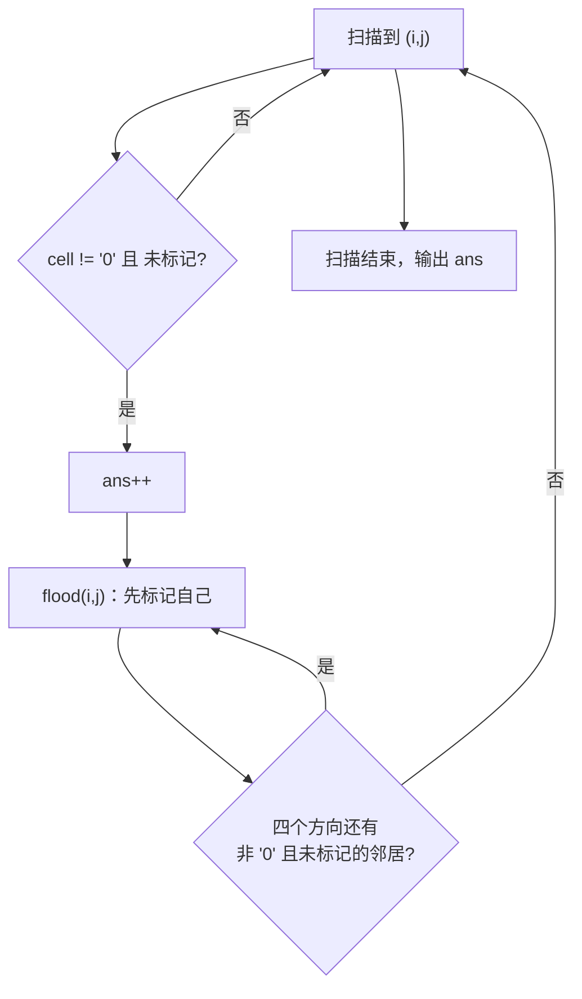

# P1451 求细胞数量

> 原题链接：<https://www.luogu.com.cn/problem/P1451>
> 题面逐字版：[`problem.txt`](problem.txt)
> 本目录导航：[← 题库索引](../../../README.md) ｜ [题目原文](problem.txt) · [讲解代码](solution.cpp) · [元信息](metadata.yml) · [验算脚本](verify.js)（仅用于验证，非讲解代码）

## 元信息

| 项目 | 内容 |
| --- | --- |
| 难度 | 洛谷难度 2（连通块计数模板，四方向版） |
| 来源 | 洛谷 P1451 |
| 标签 | 搜索、DFS、洪水填充、连通块计数、四方向、并查集（参照实现） |
| 时间复杂度 | $O(4NM)$，每格至多进一次洪泛；实测 $100\times100$ 全细胞 $6$ ms |
| 空间复杂度 | $O(NM)$ 网格 + `vis` + 递归栈（$100\times100$ 全 '1' 时约 $10^4$ 层，本机正常结束） |
| 评测状态 | 未本地评测（未在洛谷提交）；本机编译无警告，官方样例逐字正确，与并查集参照实现随机对拍 200 组 0 不一致（见"验证结论"） |

## 题目大意

> **原文（逐字）**："一矩形阵列由数字 $0$ 到 $9$ 组成，数字 $1$ 到 $9$ 代表细胞，细胞的定义为**沿细胞数字上下左右**若还是细胞数字则为同一细胞，求给定矩形阵列的细胞个数。"

翻译成人话：$n$ 行 $m$ 列的数字矩阵，`0` 是空白，`1`~`9` 都算"细胞物质"。互相**上下左右**相邻的细胞格子属于**同一个细胞**，问一共有几个细胞。

- 输入：第一行 $n, m$；接下来 $n$ 行，每行一个长度 $m$ 的数字串（**字符间无空格**）
- 输出：一行一个整数 —— 细胞个数
- 数据范围：$1\le n,m\le 100$

**两处必须在题面上圈出来的细节**：
1. "上下左右" ⇒ **四个方向**，斜角不算（这是与 P1596 唯一的代码差异）；
2. "1 到 9 代表细胞 …… 若还是细胞数字则为同一细胞" ⇒ **只要对方也是非 `0` 数字就算同一细胞，数字本身不必相同**。$(1,2)$ 是 `2`、$(1,3)$ 是 `3`，它们贴边 ⇒ 同一个细胞。这一点最容易被误读成"相同数字才连通"。

## 思路推导

### 1. 直觉做法：和数水塘一模一样

本题和 P1596 是同一道题的换了皮的版本：把"水格 `W`"换成"细胞数字（非 `0`）"，把"八方向"换成"四方向"。通用模板：

```
for 每一格 (i,j):
    if 这一格是目标 且 没被标记过:
        ans++              # 发现一个新细胞
        洪泛(i, j)         # 把整块标记掉，块里剩下的格子以后再扫到也不会重复计数
```

**连通块计数 = 扫格子 + 每遇到没访问过的目标格就 `ans++` 并洪泛整块。**

### 2. 关键观察

#### 观察 1：`vis` 永不撤销 —— 与 P1605 迷宫形成对照

| | P1605 迷宫（数路径） | P1451 / P1596（数块） |
| --- | --- | --- |
| `vis` 含义 | 当前这条路径占用的格子 | 已经归进某个块、从此划掉的格子 |
| 递归返回后 | **撤销** `vis=0` | **不撤销** |
| 每格进洪泛次数 | 很多（不同路径分别经过） | **恰好一次** ⇒ 总代价线性 |

同一套 DFS，撤销与不撤销对应两类题。本题若撤销 `vis`，同一个细胞里的每一格都会各自触发一次 `ans++`，答案会趋近"细胞格子总数"而不是细胞个数。

#### 观察 2：目标条件是 `!= '0'`，不是 `== 某个数字`

题面说"沿细胞数字上下左右若**还是细胞数字**则为同一细胞" —— 判据是"对方是不是细胞数字"，与"对方和我是不是同一个数字"无关。代码里就一个条件：

```cpp
if (cell[nx][ny] != '0' && !vis[nx][ny]) flood(nx, ny);
```

**误读成"相同数字才连通"的代价**（本机实测）：官方样例 $4\times10$ 正确答案 $4$，按"数字相同才同一细胞"跑出来是 **$18$**。样例直接能抓出来，属于"送分题变成送命题"。

#### 观察 3：四方向 vs 八方向 —— 本题与 P1596 唯一的技术差异

偏移表：

```cpp
const int dx[4] = {-1, 1, 0, 0};   // 上、下、左、右
const int dy[4] = {0, 0, -1, 1};
```

**误用八方向的代价**（本机实测）：官方样例跑出来是 **$2$**（正确 $4$）；定向数据 `10/01`（斜角两个 `1`）四方向给 $2$、八方向给 $1$；`110/001/001` 这种"Z 字形只有斜角相连"的图形，四方向 $2$ 块、八方向 $1$ 块。**两道题连错题的方向都相反**：P1596 少方向会**多数**（$3\to13$），P1451 多方向会**少数**（$4\to2$）。

#### 观察 4：`char` 存图比 `int` 省事

`cin >> cell[i]` 直接读进一行数字串；判据 `!= '0'`（字符比较）即可。若写 `cin >> int`，$1\times m$ 的整行会被当成一个巨大的整数读（还会溢出），$m=100$ 时必炸 —— 这题的输入格式天生要求**按字符串读**。

### 3. 算法设计

**数据结构**：`cell[N][M]`（字符地图）、`vis[N][M]`、`ans`。

**过程**：
1. 读 $n,m$ 与 $n$ 行字符串；
2. 双重循环扫描：`cell[i][j] != '0' && !vis[i][j]` ⇒ `ans++`，`flood(i,j)`；
3. `flood(x,y)`：`vis[x][y]=true`；枚举四个方向，界内、非 `0`、未标记则递归；
4. 输出 `ans`。



### 4. 正确性说明

以"非 `0` 格子"为顶点、"四方向相邻"为边构成图 $G$，题目定义的"细胞"就是 $G$ 的连通块。

- **引理 A（洪泛恰好覆盖一块）**：`flood(s)` 结束时，被标记的格子集合恰为 $G$ 中含 $s$ 的连通块 $C(s)$。递归的进入条件是"四方向相邻 + 非 `0` + 未标记"，故每个被标记的格子都通过一条由 $s$ 出发的边链与 $s$ 相连（⊆ 成立）；反过来若 $u\in C(s)$ 未被标记，取 $s\to u$ 的最短路径，沿路径第一次出现"未标记"的格子，其前驱已标记且在枚举时必然把它拉进来，矛盾（⊇ 成立）。
- **引理 B（不重复计数）**：`ans++` 只在 `!vis[i][j]` 时执行；由引理 A，一次 `ans++` 后整块 $C(i,j)$ 全部标记，同块其余格子之后不可能再触发 `ans++`，故每个细胞至多计一次。
- **引理 C（不遗漏）**：任一细胞 $C$ 中按扫描顺序最早的格子 $p$，轮到它时 `vis[p]` 必为假（否则 $p$ 被更早的洪泛吞掉，而那次洪泛的起点比 $p$ 更早被扫描且与 $p$ 同块，与 $p$ 的取法矛盾），故 $C$ 至少被计一次。

B + C ⇒ `ans` 与细胞一一对应。$\blacksquare$

### 5. 复杂度分析

- **时间**：`vis` 保证每格至多进 `flood` 一次，每次枚举 $4$ 个方向 ⇒ $O(4NM)=4\times10^4$，本机 $100\times100$ 实测 **$4\sim6$ ms**（含进程启动）。
- **空间**：$O(NM)$ 网格 + `vis`；递归深度最坏 $=NM=10^4$（全 `1` 数据），本机正常返回。课堂上值得点一句：**深度 $10^4$ 已经不算小**，若数据再大就该换 BFS（队列）版本，逻辑一字不改，只是把栈搬到堆上。

## 板书演示（不用可视化）

官方样例 $4\times10$（`.1111` 这类图是**跑出来的编号地图**，`.` 代表 `0`，数字代表第几个细胞）：

|  | 列 1 | 2 | 3 | 4 | 5 | 6 | 7 | 8 | 9 | 10 |
| --- | --- | --- | --- | --- | --- | --- | --- | --- | --- | --- |
| **行 1** | `0` | `2` | `3` | `4` | `5` | `0` | `0` | `0` | `6` | `7` |
| **行 2** | `1` | `0` | `3` | `4` | `5` | `6` | `0` | `5` | `0` | `0` |
| **行 3** | `2` | `0` | `4` | `5` | `6` | `0` | `0` | `6` | `7` | `1` |
| **行 4** | `0` | `0` | `0` | `0` | `0` | `0` | `0` | `0` | `8` | `9` |

给每一格编上"属于第几个细胞"之后长这样（这是**板书编号**，讲解代码按题面只输出一个总数；下表可逐格核对）：

```
.1111...22
3.1111.4..
3.111..444
........44
```

| 细胞 | 扫描时触发 `ans++` 的格子 | 格数 | 包含的格子（行,列；已按行、列排序） |
| --- | --- | --- | --- |
| 1 | $(1,2)$ | $11$ | $(1,2)=2\ (1,3)=3\ (1,4)=4\ (1,5)=5\ (2,3)=3\ (2,4)=4\ (2,5)=5\ (2,6)=6\ (3,3)=4\ (3,4)=5\ (3,5)=6$ |
| 2 | $(1,9)$ | $2$ | $(1,9)=6\ (1,10)=7$ |
| 3 | $(2,1)$ | $2$ | $(2,1)=1\ (3,1)=2$ |
| 4 | $(2,8)$ | $6$ | $(2,8)=5\ (3,8)=6\ (3,9)=7\ (3,10)=1\ (4,9)=8\ (4,10)=9$ |

程序最后一行打印 `细胞个数 = 4` ✅。

**板书要盯的三个点**：
1. **细胞 1 里数字五花八门**（$2,3,4,5,6$ 都有）却是一个细胞 —— 印证观察 2："是不是细胞数字"才是判据，"数字相同"不是。
2. **细胞 4 里 $(3,10)=1$ 与 $(4,9)=8$ 互为斜角**，本身并不相邻，是靠 $(3,9)=7$ 这一格拐弯把两者连起来的（定向数据 `10/01`：四方向 $2$ 块、八方向 $1$ 块 —— "只共顶点"不算连通）。
3. 扫描顺序是"先行后列"，所以细胞 $1$ 的起点是 $(1,2)$ 而不是 $(2,1)$；$(2,1)$ 要等到扫到第 $2$ 行时才成为细胞 $3$ 的起点。

## 讲解代码

完整逐段注释版见 [`solution.cpp`](solution.cpp)。核心：

```cpp
const int dx[4] = {-1, 1, 0, 0};   // 只有上下左右：题面"沿细胞数字上下左右"
const int dy[4] = {0, 0, -1, 1};

void flood(int x, int y) {
    vis[x][y] = true;                                    // 先标记自己，绝不撤销
    for (int d = 0; d < 4; d++) {
        int nx = x + dx[d], ny = y + dy[d];
        if (nx < 0 || nx >= n || ny < 0 || ny >= m) continue;      // 先判范围
        if (cell[nx][ny] != '0' && !vis[nx][ny]) flood(nx, ny);    // 只看"是不是细胞数字"
    }
}
// main：
for (int i = 0; i < n; i++)
    for (int j = 0; j < m; j++)
        if (cell[i][j] != '0' && !vis[i][j]) { ans++; flood(i, j); }
```

**一行数字串怎么读？** `char cell[105][105]; cin >> cell[i];` —— `>>` 读字符串会跳过换行、读完这一行的 $m$ 个字符，正好。想逐格读也可以 `cin >> cell[i][j]`（`>>` 对 `char` 也跳空白），但**不要**用 `int` 读整行。

## 验证结论

本机 `g++ -static -O2 -std=c++14 -Wall` 编译，**无任何警告输出**。以下为 `node verify.js` 的真实输出（编译产物在 `E:/ai/suanfa_study/_work/search-b/`）：

| 检验项 | 实测结果 |
| --- | --- |
| 官方样例（$4\times10$） | 输出 `4`，与题面**逐字一致** ✅（并查集参照同给 $4$） |
| 随机对拍 | $200$ 组（$n,m\le12$，`0` 比例随机取 $0.1/0.25/0.5/0.75/0.9$）vs **并查集（合并四邻域非 `0` 格后数不同根）**参照实现，**不一致 $0$ 组** |
| 定向边界 | `10/01`（斜角两格）→ `2`；`19`（相邻不同数字）→ `1`；`0000` → `0`；$4\times4$ 全 `9` → `1`；$1\times1$ `0` → `0`；十字形 `010/111/010` → `1`；Z 字形 `110/001/001` → `2`（均与参照一致） |
| 极限规模 $100\times100$ 全 `1`（单个巨细胞，递归约 $10^4$ 层） | 细胞数 `1`，耗时 **5~6 ms** |
| 极限规模 $100\times100$ 随机（`0` 占 $0.5$，每次图不同） | 细胞数 **$684\sim730$**（两轮独立实测：初测落在 $697\sim730$，验收重跑落在 $684$），耗时 **5 ms** |
| 极限规模 $100\times100$ 竖条纹 `0/1` 交替 | 细胞数 `50`，耗时 **4~5 ms** |
| 反例对照（同一份样例数据） | 误用八方向 → `2`（应 $4$）；误以为"数字相同才同一细胞" → `18`（应 $4$） |

> `verify.js` **只是验证工具，不是讲解代码**（讲解代码一律 C++，见 AGENTS.md §3）。参照实现刻意换机制：用**并查集**把四邻域的细胞格合并，最后数根；与"扫描 + 递归洪泛"不是一条路子。

**洛谷提交结果未获取，因此不下 AC 结论。**

## 易错点与坑

1. **把方向写成八个**。本题题面只说"上下左右"。实测官方样例 $4\to2$，把两个本来分开的细胞并成了一个。**和 P1596 恰好相反：那题少了斜角会多数，这题多了斜角会少数。**
2. **要求"数字相同"才算同一细胞**。题面判据是"还是细胞数字"（即非 `0$`），与数字是否相等无关。实测官方样例 $4\to18$。
3. **`0` 的判定用整数还是字符**。存成 `char` 就写 `!= '0'`（字符零，码值 $48$）；如果先 `cell[i][j]-'0'` 转成整数再存，就要写 `!= 0`。两者混用（`char` 数组里写 `!= 0`）会把每一格都当成细胞 —— 因为 `char` 的 `'0'` 不是数值 $0$。
4. **越界判断写在数组访问之后**。`if (cell[nx][ny] != '0' && nx >= 0 ...)` 先越界访问了 `cell[-1]`，本机可能"读脏数据不崩"，属于最阴的一类 WA。规则永远是**先判范围**。
5. **`flood` 忘了先标记自己**（把 `vis[x][y]=true` 写在循环之后）。同一块会被无限反复展开，$100\times100$ 全 `1` 的数据直接跑不完 —— 现象是"超时"而不是"崩溃"，很难定位。
6. **回溯撤销 `vis`**（把 P1605 的习惯带过来）。数块不撤销；撤销后同一块里每格都会各自 `ans++`，答案接近"细胞格总数"。
7. **整行当整数读**。$m=100$ 的一行数字有 $100$ 位，`cin >> int` 立刻溢出、后面全部读歪。必须按字符串读（观察 4）。
8. **$n,m$ 与行列搞反**。$n$ 是行数、$m$ 是列数；$n\ne m$ 的测试点专卡这一点（外层 `i<n`、内层 `j<m`）。
9. **并查集参照里数根时把 `0` 格也算进去**。正确做法是只对非 `0$` 格子收集 `find(id)`。$4\times10$ 样例共 $40$ 格、其中细胞格 $21$ 个：只数细胞的根 $=4$（正确），数全部格子的根会把 $19$ 个 `0` 格各算一块，得 $23$。**数根前先过滤顶点集合。**
10. **递归深度**。$100\times100$ 全 `1` 时递归约 $10^4$ 层，本机（Windows，`-static`）正常；但这是"恰好够"，不是"永远够"，课上要说明换 BFS 的动机。

## 常见变式

| 变式 | 差异 | 应对 / 对应题号 |
| --- | --- | --- |
| 八方向连通 | 偏移表 $4$ 项 → $8$ 项 | 洛谷 P1596 数水塘（本批同目录，两题对照着讲） |
| 目标是同一字符（如 `W`）而不是"非 `0$`" | 判据换一下 | P1596；再比如"数 lake / island" 各类网格题 |
| 求最大细胞的面积 | `flood` 里累加格子数，外面取 `max` | 框架不动，$3$ 行改动 |
| 求每个细胞的周长 / 边界格 | 洪泛时对每个方向判断"是否出界或为 `0$`" | 课堂练习，仍是 $O(4NM)$ |
| 多次询问"两格是否同一细胞" | 洪泛时给每格写"块编号"（本页板书画的编号地图），询问变成比较编号 | 也可用并查集（`verify.js` 里的参照实现就是入门版） |
| 数字代表**不同种类**的细胞，同类才连通 | 判据变成 `cell[nx][ny]==cell[x][y]` | 这时坑 2 的"错误写法"反而是正确解 —— **一切以题面判据为准** |

## 小结

> **数块的模板只有一句：扫到没标记的目标格就 `ans++` 并洪泛整块、标记永不撤销；本题的全部陷阱都在"目标条件"上 —— 判据是"非 `0$` 的细胞数字"和"只有上下左右"，不是"数字相同"、更不是"八方向"。**
