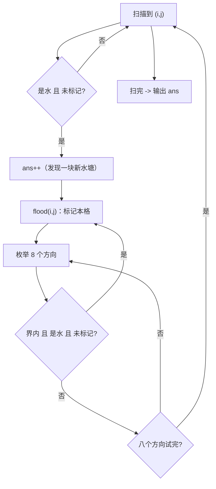

# P1596 [USACO10OCT] Lake Counting S

> 原题链接：<https://www.luogu.com.cn/problem/P1596>
> 题面逐字版（USACO 英文原文）：[`problem.txt`](problem.txt)
> 本目录导航：[← 题库索引](../../../README.md) ｜ [题目原文](problem.txt) · [讲解代码](solution.cpp) · [元信息](metadata.yml) · [验算脚本](verify.js)（仅用于验证，非讲解代码）

## 元信息

| 项目 | 内容 |
| --- | --- |
| 难度 | 洛谷难度 2（连通块计数模板） |
| 来源 | 洛谷 P1596 / USACO 2010 October Silver |
| 标签 | 搜索、DFS、洪水填充、连通块、八方向、并查集（参照实现） |
| 时间复杂度 | $O(8NM)$，每格至多进一次洪泛，实测 $100\times100$ 全水 $6$ ms |
| 空间复杂度 | $O(NM)$ 网格 + `vis` + 递归栈（$100\times100$ 全水时递归最深 $10^4$ 层，本机正常结束） |
| 评测状态 | 未本地评测（未在洛谷提交）；本机编译无警告，官方样例逐字正确，与并查集参照实现随机对拍 200 组 0 不一致（见"验证结论"） |

## 题目大意

> **原文（逐字，USACO 英文）**："Due to recent rains, water has pooled in various places in Farmer John's field, which is represented by a rectangle of N x M (1 <= N <= 100; 1 <= M <= 100) squares. Each square contains either water ('W') or dry land ('.'). Farmer John would like to figure out how many ponds have formed in his field. **A pond is a connected set of squares with water in them, where a square is considered adjacent to all eight of its neighbors.** Given a diagram of Farmer John's field, determine how many ponds he has."

中文复述（原文是 USACO 英文题面）：农夫约翰的田地是 $N$ 行 $M$ 列的方格，每格要么是水 `W`，要么是干地 `.`。**水塘** = 一堆互相连通的水格，而"相邻"按 **八个方向** 算（上下左右 + 四个斜角）。给整块田地图，问有几个水塘。

- 输入：第一行 $N, M$；接下来 $N$ 行，每行 $M$ 个字符，**中间没有空格**
- 输出：一行一个整数 —— 水塘个数
- 数据范围：$1\le N\le 100$，$1\le M\le 100$

**问题本质**：把格子当图的顶点、八邻域当边，求**连通块个数**。这是所有"数块数"题目的共同骨架。

## 思路推导

### 1. 直觉做法：把每一块水"淹掉"就不再数第二遍

最笨的想法：对每个水格都跑一遍洪泛，看它属于哪一块 —— 但同一块里的 $16$ 个格子会被当成 $16$ 次起点，答案是 $16$ 而不是 $1$。要修的不是"洪泛"，而是**别让同一块被当两次起点**。

于是自然的写法：

```
for 每一格 (i,j):
    if 这一格是水 且 没被标记过:
        ans++                       # 发现一块新水塘
        洪泛(i, j)                  # 把整块标记掉，块里剩下的格子以后不会再触发 ans++
```

**连通块计数 = 扫格子 + 每遇到没访问过的目标格就 `ans++` 并洪泛整块**。这句话是本批四道题里三道的通用模板。

### 2. 关键观察

#### 观察 1：`vis` **永不撤销**，因为它记的是"已经归到某块里了"

对比 P1605 迷宫：那边的 `vis` 是"当前这条路径经过的格子"，回溯时必须撤销；这边的 `vis` 是"全局已经处理过"，**标记了就永远划掉**。

| | P1605 迷宫 | P1596 数水塘 |
| --- | --- | --- |
| 问的是 | 多少条**路径** | 多少块**连通区域** |
| `vis` 含义 | 当前这条路的占用集合 | 已被某块吞掉的格子 |
| 递归返回后 | **撤销** `vis=0` | **不撤销** |
| 每格处理次数 | 可能很多次（不同路径分别经过） | **恰好一次**（所以总代价线性） |

若把本题的 `vis` 撤销，`ans` 会重复统计同一块水，答案**爆炸性偏大**；若把 P1605 的 `vis` 不撤销，答案退化成 $0/1$。两个方向都错，错法相反 —— 这是本批最重要的一组对照。

#### 观察 2：八方向和四方向的差别只有那两行偏移表

题面写 "adjacent to all **eight** of its neighbors"，所以斜角也算连通：

```cpp
const int dx[8] = {-1, 0, 1, 1, 1, 0, -1, -1};
const int dy[8] = { 1, 1, 1, 0,-1,-1, -1,  0};
```

它覆盖 $\{-1,0,1\}^2\setminus\{(0,0)\}$。P1451（求细胞数量）的题面只说"沿细胞数字上下左右"，偏移表就要换成 $4$ 项 —— 那是两题**唯一**的代码差异。

漏斜角的后果（本机实测，把偏移表改成 $4$ 方向跑同一份数据）：

| 数据 | 八方向（正确） | 四方向（漏斜角） |
| --- | --- | --- |
| **官方样例 $10\times12$** | $3$ | $13$（**样例就能抓出来**） |
| `W.` / `.W`（对角两滴水） | $1$ | $2$ |
| $1\times8$ 交替 `W.W.W.W.` | $4$ | $4$（这种数据抓不出来，斜角本来不相邻） |
| $100\times100$ 棋盘格 | $1$（斜着全连着） | $5000$ |

棋盘格那一行很有画面感：按八方向看，`W` 沿斜线连成一整片，水塘数 $1$；按四方向看每格孤立，$5000$。**"斜角算不算相邻"能把答案差四个数量级。**

#### 观察 3：扫描顺序决定"每块从哪个格子开始洪泛"

代码从 $(0,0)$ 起按行扫描，所以第 $1$ 块一定从**最靠上、再最靠左**的那个水格开始（官方样例里是 $(1,1)$）。这一点在板书时要说清楚，因为它决定了"为什么这块被数了一次而不是那格被数一次"。

#### 观察 4：一行 $M$ 个字符没有空格 ⇒ 用 `cin >> field[i]` 整行读

`cin >> 字符串` 会跳过换行、读到下一个空白为止，正好一口气吞下一行 $M$ 个字符。若逐格 `cin >> ch`，逻辑也对，但代码更长且容易和 `getline` 混用出错。

### 3. 算法设计

**数据结构**：`field[N][M]` 地图，`vis[N][M]` 布尔（该格是否已归入某水塘），`ans` 计数。

**过程**：
1. 读入地图；
2. 双重循环扫全部格子，遇 `field[i][j]=='W' && !vis[i][j]`：`ans++`，调用 `flood(i,j)`；
3. `flood(x,y)`：标记 `vis[x][y]=true`；枚举 $8$ 个方向，若新格在界内、是水、未标记则递归；
4. 输出 `ans`。



### 4. 正确性说明

要证：程序输出的 `ans` 恰为八方向意义下水格连通块个数。

把"八方向相邻"作为边、水格作为顶点，得到的图 $G$ 的连通块就是题目定义的水塘（题面 "A pond is a connected set of squares with water in them, where a square is considered adjacent to all eight of its neighbors" 正是连通块的定义）。

- **引理 A（洪泛的完整性）**：`flood(s)` 结束后，`vis` 为真的水格集合恰为 $G$ 中含 $s$ 的连通块 $C(s)$。
  递归只在"是水且未标记"的八邻格上继续，因此被标记的每个格子都与某个已标记格子相邻、最终与 $s$ 相邻链相连 ⊆ $C(s)$；反过来，若 $u\in C(s)$ 却未被标记，取 $s$ 到 $u$ 的一条最短路径，第一次"未标记"的格子前一个必已标记（起点 $s$ 已标记，故存在），而该前驱在枚举方向时一定会把 $u$ 拉进来，矛盾。
- **引理 B（不重）**：主循环只对 `!vis[i][j]` 的水格 `ans++`。由引理 A，一次 `ans++` 之后整块 $C(i,j)$ 都被标记，故同一连通块中其余格子之后都不可能再触发 `ans++`。
- **引理 C（不漏）**：设 $C$ 为任一水塘，按扫描顺序取 $C$ 中第一个被主循环看到的格子 $p$。在轮到 $p$ 之前，$C$ 中没有任何格子被洪泛过（否则那次洪泛的起点在 $p$ 之前被扫描到，与 $p$ 的取法矛盾），故 `vis[p]` 为假；$p$ 是水格，于是主循环在 $p$ 处必定执行一次 `ans++`。

由引理 B、C，$ans$ 与水塘集合一一对应。$\blacksquare$

### 5. 复杂度分析

- **时间**：`vis` 保证每个格子至多进入 `flood` 一次，每次进入枚举 $8$ 个方向 ⇒ $O(8NM)$；主循环本身 $O(NM)$。$N=M=100$ 时约 $8\times10^4$ 次判断，本机实测 **6 ms**（含进程启动，重复运行 5~6 ms）。若按"每个水格都重新洪泛一遍"的错误写法，是 $O(8N^2M^2)=8\times10^8$，会明显超时。
- **空间**：地图 + `vis` = $O(NM)$；递归栈深度最坏等于整块水的格子数（$100\times100$ 全水时约 $10^4$ 层），实测正常结束。如果课堂上担心栈深度，可以把 `flood` 改成手写栈/队列的 BFS 版本，**答案不变，只是"不撤销"这一点不变**。

## 板书演示（不用可视化）

官方样例（$10\times12$）。下面这张"编号地图"是**实际跑出来的**：把每个水格替换成它所属水塘的编号，`.` 仍是干地。

```
1........22.
.111.....222
....11...22.
.........22.
.........2..
..3......2..
.3.3.....22.
3.3.3.....2.
.3.3......2.
..3.......2.
```

三块水塘（编号即扫描顺序）：

| 编号 | 扫描时第一个碰到的水格 | 格数 | 包含的格子（行列均 $1$ 起） |
| --- | --- | --- | --- |
| 1 | $(1,1)$ | $6$ | $(1,1)\ (2,2)\ (2,3)\ (2,4)\ (3,5)\ (3,6)$ |
| 2 | $(1,10)$ | $16$ | $(1,10)\ (1,11)\ (2,10)\ (2,11)\ (2,12)\ (3,10)\ (3,11)\ (4,10)\ (4,11)\ (5,10)\ (6,10)\ (7,10)\ (7,11)\ (8,11)\ (9,11)\ (10,11)$ |
| 3 | $(6,3)$ | $9$ | $(6,3)\ (7,2)\ (7,4)\ (8,1)\ (8,3)\ (8,5)\ (9,2)\ (9,4)\ (10,3)$ |

讲解代码按题面只输出一个数字（本机这次输出 `3`）；上面这张编号地图来自**同逻辑的插桩版**（只多打日志），它最后一行打印 `水塘总数 = 3`。和题面提示对上了：

> "There are three ponds: one in the upper left, one in the lower left, and one along the right side."

**板书要点的两处"斜角"**：
- 第 $1$ 块：$(1,1)$ 与 $(2,2)$ **只共顶点、不共边**，靠"斜角相邻"才是一块；$(2,4)\to(3,5)$ 同理。本机把"只保留第 $1$ 块的 $6$ 个水格"这张图单独按四方向跑，结果是 $3$ 块（而不是 $1$ 块）。
- 第 $3$ 块：$(6,3)$ 往下是 $(7,2),(7,4)$，再往下 $(8,1),(8,3),(8,5)$，整块是一条**斜着走的虚线链**，$9$ 个格子两两之间只有斜角关系。同样单独按四方向跑，结果是 $9$ 块 —— **每个格子各自一块**。

再对照"扫描 + 洪泛"的动作序列（下面这张表按插桩版逐块打印的顺序整理，`ans` 那一列就是它每发现一块时 `++` 的值）：

| 扫描位置 | 判断 | 动作 | `ans` |
| --- | --- | --- | --- |
| $(1,1)$ | 是 `W`，未标记 | `ans++`，洪泛整块 → $6$ 格标记 | $1$ |
| $(1,10)$ | 是 `W`，未标记（中间 $(2,2)$ 等已被标记，扫描时直接跳过） | `ans++`，洪泛 → $16$ 格 | $2$ |
| $(6,3)$ | 是 `W`，未标记 | `ans++`，洪泛 → $9$ 格 | $3$ |
| 其余水格 | 已全部标记 | 跳过 | $3$ |

## 讲解代码

完整逐段注释版见 [`solution.cpp`](solution.cpp)。核心：

```cpp
const int dx[8] = {-1, 0, 1, 1, 1, 0, -1, -1};   // 八方向：含四个斜角
const int dy[8] = { 1, 1, 1, 0,-1,-1, -1,  0};

void flood(int x, int y) {
    vis[x][y] = true;                                   // 标记了就永不撤销
    for (int d = 0; d < 8; d++) {
        int nx = x + dx[d], ny = y + dy[d];
        if (nx < 0 || nx >= n || ny < 0 || ny >= m) continue;   // 先判范围
        if (field[nx][ny] == 'W' && !vis[nx][ny]) flood(nx, ny);
    }
}
// main：
for (int i = 0; i < n; i++)
    for (int j = 0; j < m; j++)
        if (field[i][j] == 'W' && !vis[i][j]) { ans++; flood(i, j); }
```

**为什么 `flood` 里不判 `field[x][y]`？** 因为调用方已经保证 $(x,y)$ 是水（入口在主循环里判过，递归里判过 `field[nx][ny]=='W'`）。把"是水"这个条件只写在**唯一一处**，就不会出现"两边条件不一致"的低级 bug。

## 验证结论

本机 `g++ -static -O2 -std=c++14 -Wall` 编译，**无任何警告输出**。以下为 `node verify.js` 的真实输出（编译产物在 `E:/ai/suanfa_study/_work/search-b/`）：

| 检验项 | 实测结果 |
| --- | --- |
| 官方样例（$10\times12$） | 输出 `3`，与题面**逐字一致** ✅（并查集参照同给 $3$） |
| 随机对拍 | $200$ 组（$n,m\le12$，水密度随机取 $0.1/0.3/0.5/0.7/0.95$）vs **并查集（合并八邻域水格后数不同根）**参照实现，**不一致 $0$ 组** |
| 定向边界 | 对角两滴 → `1`；$3\times3$ 斜线 → `1`；全干地 → `0`；$5\times5$ 全水 → `1`；$1\times1$ 单格水 → `1`；$1\times8$ 交替 `W.W.W.W.` → `4`（均与参照一致） |
| 极限规模 $100\times100$ 全水（递归最深，$10^4$ 层） | 水塘数 `1`，耗时 **6 ms** |
| 极限规模 $100\times100$ 随机（水密度 $0.5$，每次图不同） | 水塘数 $43\sim55$（两轮独立实测：初测 $43\sim47$，验收重跑 $55$），耗时 **5~6 ms** |
| 极限规模 $100\times100$ 棋盘格 | 水塘数 `1`，耗时 **5 ms** |
| 反例对照：偏移表误写成 $4$ 方向 | 官方样例输出 `13`（应 $3$）、对角两滴 `2`（应 `1`）、$100\times100$ 棋盘 `5000`（应 `1`） |

> `verify.js` **只是验证工具，不是讲解代码**（讲解代码一律 C++，见 AGENTS.md §3）。参照实现刻意换机制：用**并查集**把八邻域的水格合并，最后数根；与"扫描 + 递归洪泛"完全不是一条路子。

**洛谷提交结果未获取，因此不下 AC 结论。**

## 易错点与坑

1. **八方向漏了斜角（本题第一大坑）**。偏移表只写 $4$ 项，或者用两层 `for (di=-1..1) for (dj=-1..1)` 时忘了 `if (di==0&&dj==0) continue;`。实测官方样例输出 $13$（正确 $3$），$100\times100$ 棋盘格输出 $5000$（正确 $1$）。**本题样例能抓到这个错**，所以样例过了别急着高兴 —— 还有坑 2。
2. **越界判断写在数组访问之后**。`if (field[nx][ny]=='W' && nx>=0 ...)` 会先拿 `nx=-1` 去访问 `field[-1]`。数组开大一点时可能"读到脏数据也不崩"，属于最危险的一类 WA（本机换到大网格才会崩）。**永远先判范围再访问元素**。
3. **`flood` 里把 `vis[x][y]=true` 写在递归之后**（或者干脆不写）。同一块水会被反复展开，$100\times100$ 全水时直接变成指数级调用 —— 程序从 $6$ ms 变成跑不完，而且是**死循环式的重复**而不是崩溃，学生很难定位。规则：**进入函数第一件事就是标记自己**。
4. **回溯时撤销 `vis`**（把 P1605 的习惯带过来）。`flood` 返回后写 `vis[nx][ny]=false`，同一块水会被反复 `ans++`，答案严重偏大。**"数块"不撤销，"数路径"才撤销。**
5. **并查集参照里把干地也算进根数**。正确做法是只枚举 `field[i][j]=='W'` 的格子去收集 `find(id)` 到 `Set` 里。本机实测官方样例：水格 $31$ 个、干地 $89$ 个，**只数水的根 = $3$（正确）**，而"对全部 $120$ 个格子数根" = $3+89=\mathbf{92}$ —— 因为干地从不参与合并，每格都是独立的根。**"数根之前先过滤顶点集合"是并查集数连通块的通用陷阱。**
6. **`find` 没写路径压缩/路径 halving**：递归版 `find` 在最坏情况下链很长，$10^4$ 规模还能过，$10^6$ 就危险。参照实现里 `fa[x]=fa[fa[x]]` 那句顺手就能做掉。
7. **输入按字符读，把换行也吃掉**。$N$ 行每行 $M$ 个字符中间无空格，`cin >> field[i]`（读字符串）最稳；如果写 `for(i)for(j) cin >> field[i][j]` 也要保证不把换行读成字符（`>>` 会跳空白，实际也安全），但混用 `getline` 就容易读到空行。
8. **$N$ 和 $M$ 谁是谁搞反**。题面 "N x M"，$N$ 是行数、$M$ 是每行字符数。读到 `cin >> n >> m` 后循环必须是 `i<n`（行）、`j<m`（列）。$N\ne M$ 的数据会专挑这一点。
9. **递归栈的隐患**：$100\times100$ 全水时递归深度约 $10^4$（本机正常）。但"题面 $100\times100$、把 `flood` 写成递归"这件事本身值得在课上说明：**换 BFS（队列）只是把栈搬到堆上**，深递归不可靠时优先改 BFS。

## 常见变式

| 变式 | 差异 | 应对 / 对应题号 |
| --- | --- | --- |
| 四方向连通（"沿上下左右"） | 只换偏移表：$8$ 项 → $4$ 项 | 洛谷 P1451 求细胞数量（本批同目录） |
| 目标格由"字符 `W`"改成"数字 $1\sim9$" | 判断条件从 `=='W'` 变成 `!='0'` | 洛谷 P1451 |
| 问"最大一块有多大" | `flood` 返回/累加格子数，`ans` 换成 `mx` | 课堂练习，代码改动 $3$ 行 |
| 问"两块水格是否同塘"（多次询问） | 洪泛时给每格写"块编号"，询问变成比较编号 | 编号地图正是本页板书画的那张 |
| 静态连通性 + 边逐步加入 | 离线扫完再用**并查集**，天然支持"加边后是否连通" | 本目录 `verify.js` 里的参照实现就是入门版并查集 |
| 动态加边数连通块（在线） | 洪泛要重扫，代价高 | 并查集：`ans` 初始 $=$ 顶点数，每次成功合并 `ans--` |
| 三维田地（$N\times M\times K$） | 方向数变 $26$ | 偏移表加长，框架不变 |

## 小结

> **数"块"的题只有一句模板：扫描到没标记的目标格就 `ans++` 并把整块洪泛掉、标记永不撤销；本题全部的特殊性都在"八方向"那两行偏移表上。**
