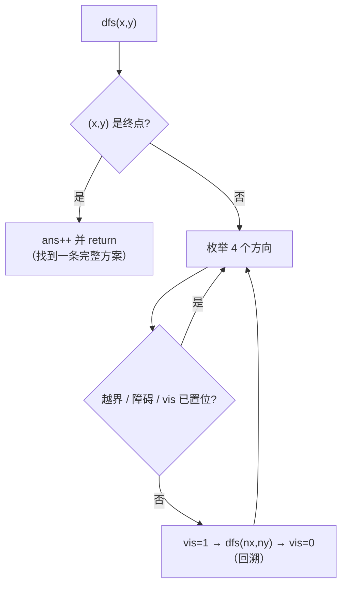

# P1605 迷宫

> 原题链接：<https://www.luogu.com.cn/problem/P1605>
> 题面逐字版：[`problem.txt`](problem.txt)
> 本目录导航：[← 题库索引](../../../README.md) ｜ [题目原文](problem.txt) · [讲解代码](solution.cpp) · [元信息](metadata.yml) · [验算脚本](verify.js)（仅用于验证，非讲解代码）

## 元信息

| 项目 | 内容 |
| --- | --- |
| 难度 | 洛谷难度 2（DFS 计数入门模板） |
| 来源 | 洛谷 P1605 |
| 标签 | 搜索、DFS、回溯、路径计数、网格 |
| 时间复杂度 | 指数级（枚举所有简单路径）。本机实测：$3\times3$ 全空 $51$ 次 `dfs` 调用、$5\times5$ 挡中心一格 $19545$ 次调用（$1456$ 条方案） |
| 空间复杂度 | $O(NM)$ 网格 + 递归栈 $O(NM)$（最深 $NM$ 层，本机 $5\times5$ 极限数据无栈溢出） |
| 评测状态 | 未本地评测（未在洛谷提交）；本机编译无警告，官方样例逐字正确，与状态压缩参照实现随机对拍 200 组 0 不一致（见"验证结论"） |

## 题目大意

> **原文（关键句）**："给定一个 $N \times M$ 方格的迷宫，迷宫里有 $T$ 处障碍，障碍处不可通过。在迷宫中移动有上下左右四种方式，每次只能移动一个方格。数据保证起点上没有障碍。给定起点坐标和终点坐标，**每个方格最多经过一次**，问有多少种从起点坐标到终点坐标的方案。"

翻译成人话：在一个最多 $5\times 5$ 的格子里，有些格是墙。从起点走到终点，每步只能上下左右走一格，**走过的格子不能再走**。问这样的走法**一共有多少种**（不是问能不能到，也不是问最短几步）。

- 输入：$N,M,T$；一行 $S_X,S_Y,F_X,F_Y$（行列都是 $1$ 开始）；$T$ 行障碍坐标
- 输出：一个整数 —— 方案总数
- 数据范围：$1\le N,M\le 5$，$1\le T\le 10$

**先明确"方案"是什么**：两条方案不同，当且仅当它们经过的格子**序列**不同。所以本题是**计数**题，不是"能否到达"的判断题，也不是最短路径题。这个理解决定了后面全部代码。

## 思路推导

### 1. 直觉做法：把能走的路都走一遍

规模才 $5\times5=25$ 格，最诚实的想法就是"暴力搜"：站在当前格，挨个试四个方向，能走就走进去，走到终点记一次数。这在搜索里叫 **DFS（深度优先搜索）**——一条路走到黑，走不通再退回上一步换别的方向。

和"判断能否到达"（比如本批的 P1596、P1451）相比，本题多了一个要求：**每个方格最多经过一次**。这带来的差别不是常数，而是**一类题和另一类题的分水岭**，见观察 2。

### 2. 关键观察

#### 观察 1：连通块计数 = 扫格子 + 遇到没访问过的目标格就 `ans++` 并洪泛整块

这是 P1596 / P1451 / P1162 的共同套路，先摆在这里做对照：
```
for 每一格:
    if 这一格是目标 且 没被访问过:
        ans++
        洪泛(这一格)     # 把整块全标记成已访问，标记了就不撤销
```
"不撤销"是关键：洪泛的目的是**把这一块格子从待办清单里划掉**，划掉就不再管它。

#### 观察 2：本题"每个方格最多经过一次" ⇒ 回溯时**必须撤销** `vis`

本题的 DFS 结构长得一样，但含义完全不同：
```
vis[nx][ny] = true;      # 我这条路上经过了这个格子
dfs(nx, ny);             # 把剩下的路交给它
vis[nx][ny] = false;     # ★ 这条路试完了，格子还回去，别的路还可以经过它
```
`vis` 在这里表示的是**"当前正在试的这条路径"经过的格子集合**，而不是"全局访问过"。如果学观察 1 那样不撤销，程序数出来的就不是"简单路径条数"，而是别的东西。

实测（本机跑的，见"验证结论"的对照数字）：

| 数据 | 正确答案 | 忘记撤销 `vis` |
| --- | --- | --- |
| 官方样例 $2\times2$ | 1 | **1（碰巧一样！）** |
| $3\times3$ 全空，$(1,1)\to(3,3)$ | 12 | **1** |
| $5\times5$ 只挡中心一格，角到角 | 1456 | **1** |

不撤销的版本本质上退化成"只找第一条能到终点的路"，答案最多是 $1$。**最阴险的是它在官方样例上碰巧是对的** —— 样例答案恰好是 $1$，所以只看样例根本发现不了。

> 一句话记住这批题的分类：**判"一块"→ 洪泛不撤销；数"一条路"→ 回溯必撤销。**

#### 观察 3：起点也要预先标记

`dfs(sx, sy)` 进去之前要写 `vis[sx][sy] = true;`，否则"回到起点"会被当成没走过的新格子，路径里起点出现了两次，也就不再是题目要的方案。实测 $3\times3$ 全空会把 $12$ 数成 **20**，$5\times5$ 角到角会把 $1456$ 数成 **2338** —— 是**偏大**，和观察 2 的偏小方向相反，两个错刚好互相掩盖，别指望"错得明显"。

#### 观察 4：到终点要立刻 `return`，不能在终点继续走

题目数的是"从起点**到终点**的方案"，一旦踩到终点这条路就完整结束了。写成 `if (x==fx && y==fy) ans++;`（不 return）会继续从终点往外扩散，把"经过终点再离开又回来"也算成方案。

#### 观察 5：数据范围这么小，是有道理的

$5\times5$ 空格角到角的简单路径实测 **$8512$** 条（挡一格后 $1456$），DFS 调用次数在 $10^5$ 以下，$1$ 秒时限绰有余。这也提醒我们：**"搜索能过"是因为数据小**。把上限往外推一格试试（用同一份代码，仅演示，超出题面范围）：

| 网格（起点左上角、终点右下角，无障碍；$6\times6$、$7\times7$ 仅为演示，已超出题面 $N,M\le5$ 的限制） | 方案数（本机实测） |
| --- | --- |
| $4\times4$ | $184$ |
| $5\times5$ | $8512$ |
| $6\times6$ | $1262816$（耗时约 $0.32$ s） |
| $7\times7$ | $60$ s 内未跑完（被 timeout 终止） |

**从 $5\times5$ 到 $6\times6$，答案涨了约 $148$ 倍**（$8512\to1262816$），到 $7\times7$ 直接跑不完。把 $N,M$ 改成 $30$？这套做法立刻不复存在 —— 数简单路径本身就是 #P 难问题，没有多项式算法。讲课时这条曲线比任何论证都直观。


### 3. 算法设计

**状态**：当前所在格 $(x,y)$ + 当前路径经过的格子集合（用 `vis` 数组表达）。

**过程**：
1. 读入，把障碍写进 `blocked`；
2. `vis[sx][sy] = true`，调用 `dfs(sx, sy)`；
3. `dfs(x,y)`：若 $(x,y)$ 是终点，`ans++` 并返回；否则枚举四个方向 $(nx,ny)$：越界 / 障碍 / 已在当前路径上 → 跳过；否则**标记 → 递归 → 撤销标记**；
4. 输出 `ans`。

**方向表**（只有 4 项，这是和 P1596 的唯一代码差异）：
```cpp
const int dx[4] = {1, -1, 0, 0};   // 下 上 右 左
const int dy[4] = {0, 0, 1, -1};
```



### 4. 正确性说明

**要证**：程序输出的 `ans` 恰为"从起点到终点、每格最多经过一次"的路径条数。

对递归树归纳。`dfs(x, y)` 被调用时，维护两条不变式：
- (I1) 从起点到 $(x,y)$ 存在一条路径，其经过的格子集合恰为 $\{vis = \text{true}\}$，且无重复格子；
- (I2) 每条这样的部分路径恰好对应递归树上的一个结点（不会被重复展开）。

**(I1) 的建立**：入口 `dfs(sx,sy)` 时 `vis` 只含起点，成立。递归调用前把 $(nx,ny)$ 置位，而 $(nx,ny)$ 与 $(x,y)$ 四方向相邻且未在原集合中，故新集合仍是一条无重复格子的路径，(I1) 保持。

**(I2) 的不重不漏**：`vis[nx][ny]` 的"已访问即跳过"检查保证路径不自交；回溯把 `vis` 恢复成调用前的样子，因此同一层里后续分支看到的可选格子集合与之前完全一致，不会因为前面分支的搜索而少一条路 —— 这正是"撤销"的意义。反过来，`ans++` 只在 $x=f_x \wedge y=f_y$ 时发生且随即 `return`，所以每条完整方案恰好被计数一次，且计数之后不会再往外扩散。

综上，递归树与"所有满足条件的路径"一一对应，`ans` 即所求。$\blacksquare$

### 5. 复杂度分析

- **时间**：设可行走格子数 $F=NM-T\le 25$，每条简单路径长不超过 $F$，每个结点枚举 $4$ 个方向 ⇒ $O(4\cdot F\cdot(\text{路径条数}))$，是**指数级**的。本机实测调用次数：$3\times3$ 全空 $51$ 次调用（$12$ 条方案）、$5\times5$ 挡中心一格 $19545$ 次调用（$1456$ 条方案）、$5\times5$ 全空 $90111$ 次调用（$8512$ 条方案）。$1$ 秒时限下**余量充足**，但增长极快（见观察 5 的表）。
- **空间**：`blocked`/`vis` 各 $O(NM)$；递归深度不超过 $F$（每层至少多占一个格子），$5\times5$ 时最深 $25$ 层左右，**远不到栈上限**。但要注意：这套写法一旦格子变大（如 $30\times30$）递归深度和调用次数都会失控 —— 这是"数据小才敢搜"的题，不是"我的栈够用"的题。

## 板书演示（不用可视化）

### ① 官方样例：$2\times2$，障碍在 $(1,2)$，起点 $(1,1)$，终点 $(2,2)$

网格（`S` 起点、`F` 终点、`#` 障碍）：

|  | 第 1 列 | 第 2 列 |
| --- | --- | --- |
| **第 1 行** | `S(1,1)` | `#(1,2)` |
| **第 2 行** | `(2,1)` | `F(2,2)` |

方向表顺序是 **下、上、右、左**，下面是**程序实际打印出来的调用轨迹**（`trace` 版代码，只多打日志，逻辑与 `solution.cpp` 完全一致）：

```
进入 dfs(1,1)
  下 (2,1) 可走 -> vis=1
  进入 dfs(2,1)
    下 (3,1) 越界，跳过
    上 (1,1) 这条路已走过，跳过
    右 (2,2) 可走 -> vis=1
    进入 dfs(2,2)
    到达终点，ans++ -> ans=1，返回
    回溯：vis(2,2)=0
    左 (2,0) 越界，跳过
  回溯：vis(2,1)=0
  上 (0,1) 越界，跳过
  右 (1,2) 是障碍，跳过
  左 (1,0) 越界，跳过
ans=1  dfs 调用次数=3  回溯撤销次数=2
```

板书要点：只有 $3$ 次调用、$2$ 次撤销；`dfs(1,1)` 里"上一步标记的 $(2,1)$ 回来后被撤销"，说明 `vis` 是**这条路的私产**，不是全局记录。

### ② $3\times3$ 全空（$T=0$，仅用于演示），$(1,1)\to(3,3)$

程序实测：**方案数 $12$，`dfs` 调用 $51$ 次，回溯撤销 $50$ 次**。

前两条方案与第一条的回溯过程（同样取自真实轨迹）：

| 序号 | 展开 | 结果 |
| --- | --- | --- |
| 1 | `dfs(1,1)` → 下 `dfs(2,1)` → 下 `dfs(3,1)` → 右 `dfs(3,2)` → 上 `dfs(2,2)` → 上 `dfs(1,2)` → 右 `dfs(1,3)` → 下 `dfs(2,3)` → 下 `dfs(3,3)` | 到达终点，**ans=1**，回退 |
| 2 | 回退到 `dfs(2,2)` 后换方向：右 `dfs(2,3)` → 下 `dfs(3,3)` | **ans=2** |
| … | 继续按"下→上→右→左"的次序换分支 | 直到 $51$ 次调用全部展开 |

第 1 条路径长度已经到 $9$（走满 $8$ 格 + 终点），说明"绕远路"也是不同方案 —— 这正是本题和"最短路"、"能否到达"的根本区别，也是为什么**必须撤销 `vis`**：第一条路把 $(2,1),(3,1),(3,2),(2,2),(1,2),(1,3),(2,3)$ 全占了，不撤销的话第 2 条方案根本无从走起。

### ③ 反例演示：忘记撤销会怎样

| 数据 | 正解输出 | 不撤销 `vis` 的输出 |
| --- | --- | --- |
| 官方样例 | `1` | `1`（**碰巧对**） |
| $3\times3$ 全空 | `12` | `1` |
| $5\times5$ 挡中心 | `1456` | `1` |

## 讲解代码

完整逐段注释版见 [`solution.cpp`](solution.cpp)。核心：

```cpp
void dfs(int x, int y) {
    if (x == fx && y == fy) { ans++; return; }      // 到终点 = 一条完整方案，立刻收手
    for (int d = 0; d < 4; d++) {
        int nx = x + dx[d], ny = y + dy[d];
        if (nx < 1 || nx > n || ny < 1 || ny > m) continue;   // 先判合法，再碰数组
        if (blocked[nx][ny] || vis[nx][ny]) continue;
        vis[nx][ny] = true;   // 走进去
        dfs(nx, ny);          // 剩下的路交给它
        vis[nx][ny] = false;  // ★ 回溯：把格子还给别的路
    }
}
// main 里：vis[sx][sy] = true; 然后 dfs(sx, sy);
```

## 验证结论

本机 `g++ -static -O2 -std=c++14 -Wall` 编译，**无任何警告输出**。以下为 `node verify.js` 的真实输出（编译产物在 `E:/ai/suanfa_study/_work/search-b/`）：

| 检验项 | 实测结果 |
| --- | --- |
| 官方样例（$2\times2$，障碍 $(1,2)$） | 输出 `1`，与题面**逐字一致** ✅ |
| 随机对拍 | $200$ 组（$n,m\le5$，随机起终点、$1\le T\le10$）vs **状态压缩（bitmask+当前格，逐层扩展、不撤销不回溯）**参照实现，**不一致 $0$ 组** |
| 定向边界 | 起点即终点 → `1`；$3\times3$ 挡中心 → `2`；一整列障碍堵死 → `0`；$1\times3$ 直线切断 → `0`；$1\times4$ 障碍在终点前一格 → `0`（均与参照一致） |
| 极限规模 $5\times5$，$T=1$，$(1,1)\to(5,5)$ | 方案数 **1456**，耗时 **5~7 ms**（含进程启动，多次重复运行的区间） |
| 极限规模 $5\times5$，$T=1$，中心 $(3,3)\to(3,2)$ | 方案数 **1943**，耗时 **5~6 ms** |
| 递归深度 | $5\times5$ 极限数据正常结束，无栈溢出（深度上界 $25$） |

> `verify.js` 与用于打印调用轨迹的 `trace1605` 都**只是验证工具，不是讲解代码**（讲解代码一律 C++，见 AGENTS.md §3）。参照实现刻意不用"网格 `vis` + 回溯"：它把"已访问集合"压成一个整数 bitmask，按集合大小一层层扩展，天然不可能撤销，与正解机制完全不同。

**洛谷提交结果未获取，因此不下 AC 结论。**

## 易错点与坑

1. **回溯时忘记撤销 `vis`（本题第一大坑）**。写成果：`ans++` 之后不 `vis[nx][ny]=false`。实测答案从 $12$ 变 $1$、从 $1456$ 变 $1$，**而在官方样例上碰巧输出 $1$ 恰好正确** —— 样例过了不代表对了。记法：**"数路径"的 DFS 一定要还原现场**，和 P1596/P1451 的"洪泛不还原"对照记忆。
2. **`vis[sx][sy] = true` 忘了写**。起点没进"已访问集合"，路径就能中途踩回起点，方案数**变大**：实测 $3\times3$ 全空 $12\to20$，$5\times5$ $1456\to2338$。方向与坑 1 相反，两个错误同时犯还可能互相掩盖。
3. **越界判断写在数组访问之后**。`if (blocked[nx][ny] || nx > n) ...` 会先读 `blocked[0][y]` / `blocked[6][y]` 这类下标。本题数组开得比 $5$ 大，可能"读脏数据也不崩"，最坏情况是**看起来对**；换到大网格上就是 RE 或者静默 WA。规则：**先判范围，再访问元素**，两行顺序不能反。
4. **到终点后继续搜索**（`if (x==fx&&y==fy) ans++;` 少了 `return`）。程序会把"经过终点再走开"的路也数进去，答案偏大；而且终点格会被继续标记，行为难以预测。
5. **方向表写成 8 个方向**。题面写"移动有上下左右四种方式"，多了斜角就会数出题目不认的方案（和 P1596 正好相反，那题必须 8 个）。
6. **坐标顺序当成 $(x,y)$ = (列,行)**。本题 $S_X,S_Y$ 满足 $1\le S_X\le N$、$1\le S_Y\le M$，即 $X$ 是**行号**、$Y$ 是**列号**。$N\ne M$ 的测试点会专挑这个：把行列读反时，$M<N$ 的数据会让"行号"越界，直接搜飞。
7. **障碍坐标重复或落在起点/终点**。题面没承诺障碍互不相同，也不承诺障碍不在终点上。本题代码是 `blocked[x][y] = true;` 幂等赋值，重复无影响；若终点是障碍，答案自然是 $0$（实测"一整列障碍堵死"输出 `0`），这类"答案 $0$"的数据正解也要能安静地给出 $0$。
8. **递归次数与答案规模心里没数**。$5\times5$ 才 $1456$ 条，看起来很少；但简单路径条数随格子数**指数增长**（本机：$5\times5$ 全空 $8512$ 条、$6\times6$ $1262816$ 条、$7\times7$ 本机 $60$ s 未跑完）。讲课时要强调"这题能搜是数据范围送的，不是算法送的"。
9. **抄输入格式时把"第几个数"数错**。本题头部一共 $7$ 个数（$N,M,T$ 三个 + $S_X,S_Y,F_X,F_Y$ 四个），障碍从第 $8$ 个数开始。本机第一次写验算脚本时误按"前 $5$ 个数"偏移，结果参照实现把终点当成障碍，$200$ 组里 **$138$ 组不一致**、样例参照给 $0$ 而正解给 $1$。修正偏移后 $0$ 组不一致。**这是好事**：对拍脚本自己也会写错，所以第一步永远先确认官方样例两边都对，再看随机数据。

## 常见变式

| 变式 | 差异 | 应对 / 对应题号 |
| --- | --- | --- |
| 问"能否到达"而不是"多少种方案" | 不需要计数，也不需要撤销 `vis`（到达过的格子不必再看第二次） | 本批 P1596 / P1451（洪泛计数）、P1162（反向洪泛） |
| 求最短步数 | DFS 逐条枚举会超时且不是最优 | 换 BFS（层数即步数），如洛谷 P1443 马的遍历、P1135 奇怪的电梯 |
| 允许多次经过同格但要求不重复计数 | "每格最多经过一次"这个限制是本题成立的根基 | 一旦去掉，简单路径计数变成无限，题目必须给出别的终止条件 |
| 输出所有方案的路径序列 | 需要把当前路径单独存下来（`path.push_back` + 弹出） | 回溯框架相同，只是"记录现场"的位置多一个栈 |
| 网格放大到 $30\times30$ 求方案数 | 指数爆炸，DFS 不可行 | 若额外限制"每步只能向右或向下"，方案数就是组合数 / 递推 $f[i][j]=f[i-1][j]+f[i][j-1]$，从"搜索题"变成"DP 题" |
| 迷宫变成立体（$X\times Y\times Z$ 房间） | 方向表从 $4$ 项变 $6$ 项，其余框架一字不改 | 把 `vis` 开成三维、多一维偏移即可，重点仍是"撤销"那一行 |

## 小结

> **同一套 DFS：洪泛数"块"时标记永不撤销，计数数"路"时必须回溯撤销 `vis` —— 撤销这一行写不写，就是两类题的分界线；而"不撤销"的错误版本往往在样例上碰巧是对的。**
